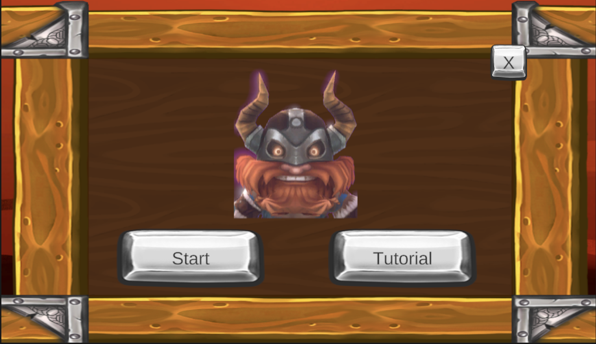
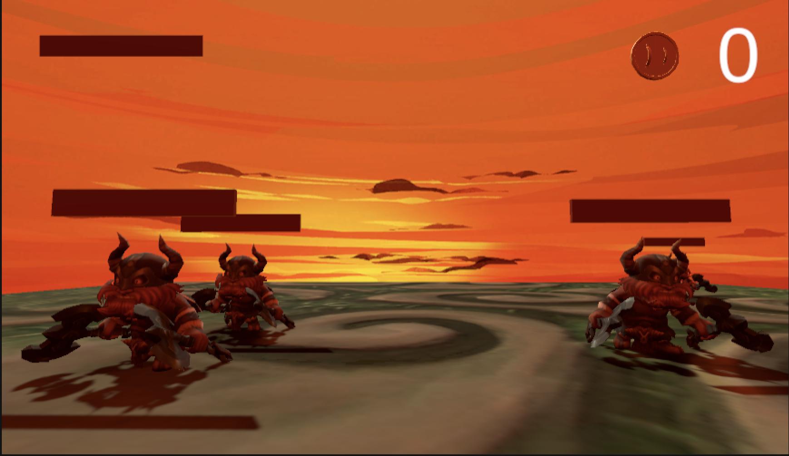
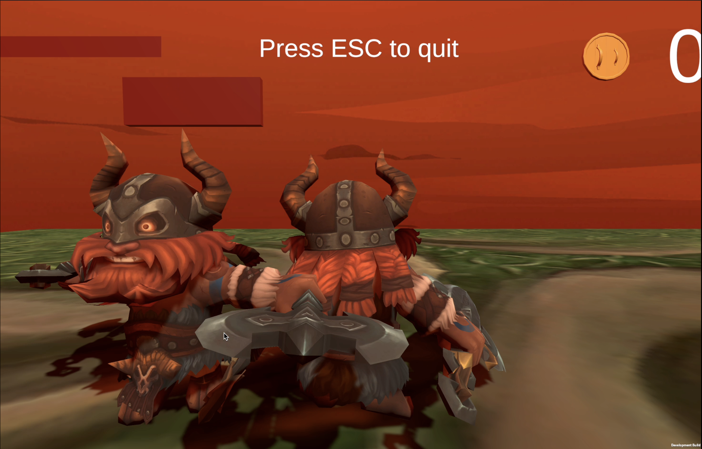
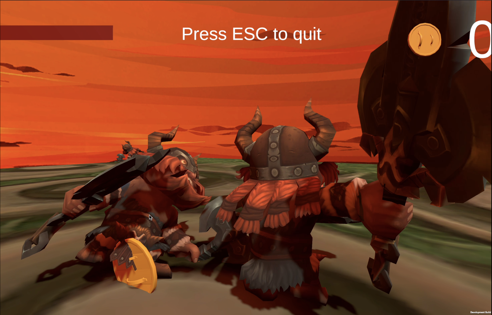

# 
維京傳奇

## 目錄

[1. Environment](#environment)

[2. How to play](#how-to-play)

[3. Intro game](#intro-game)

[4. Bonus](#bonus)

[5. Feedback](#feedback)

# Environment

Unity 2021.3.13f1

助教給的兩個安裝包：Viking 和動畫的

# How to play

移動：WASD

跳：Space

攻擊：Q

撿掉落物：F

滑鼠：移動 Camera 視角

敵人的 hp 在頭上，要攻擊他們兩次才會死亡，敵人死亡時會掉落金幣。

要注意別太靠近敵人，被發現的話，他們會跑過來攻擊你的！

# Intro game

## <b>劇情</b>

本遊戲背景設在落日餘暉下，凱旋回家的維京人發現自己陷入無限的迂迴中，昔日的隊友不斷出現來攻擊自己。而他要設法找到解脫的辦法 ⋯⋯

## <b>UI</b>

進入遊戲時會先到主畫面，可選擇開始遊戲、教學或是退出。當選擇開始遊戲後會進入遊戲之中。在遊戲中，玩家可以看到自己的血條在視角左上方；蒐集的金幣在右上方。

圖1. 主選單

圖2. 遊戲畫面

## <b>移動</b>

使用一個地板加上 trigger 碰撞器來檢測玩家是否離開地板。若離開時，會產生新的地板在玩家腳下，同時刪除原本的地板。

此外，當玩家進入新的地板時，會隨機生成 1 個敵人在玩家身旁。(生成太多敵人怕玩家秒死。)

## <b>攻擊</b>

當玩家按下 Q 後，會進行迴旋斬擊，將周圍敵人的頭砍下。同時設有貼心的按鍵設計，方便玩家取消後搖。也就是當斬擊傷害出現時，而動畫尚未結束，玩家可以再次按下 Q 來攻擊。

圖3. 玩家（右）與敵人（左）互砍，敵人血條剩一半

圖4. 敵人倒下死亡，掉落金幣

## <b>動畫</b>

玩家和敵人移動、跳躍與攻擊時都設有相對應的動畫來提昇遊戲體驗。

# Bonus

1. 地板生成後，會自動刪除舊的，不會一直生成，浪費空間；同樣，當敵人距離玩家一段距離後，會刪除掉。
2. 使用 Model-View-Controller 的方式撰寫程式以方便日後維護。
3. 添加遊戲背景音樂。
4. 設計完整故事劇情，讓玩家更加投入遊戲之中。

# Feedback

小時候曾想過以後要做遊戲設計師，現在想想還是算了。

Unity 超難的。語法好混亂，東西都可以 call 來 call 去，讓我寫起來好痛苦啊。而且時間又很緊湊，沒啥時間可以好好優化。總之，至少還是寫出個遊戲，寫出來的時候還蠻有成就感的。

deadline 的前幾個小時突然靈感大爆發，想到可以用距離來計算攻擊範圍、判斷敵人要不要追逐玩家等等。一下子提升許多進度，希望可以拿高一點分數哭哭。

我覺得這堂課的作業超多，不難但是要花時間想怎樣做跟優化，有時候都會想說：我為什麼要來修這個。但是是真的可以學到東西，寫出來的時候也很有成就感，希望最後的分數也可以高點，不然會哭死。
